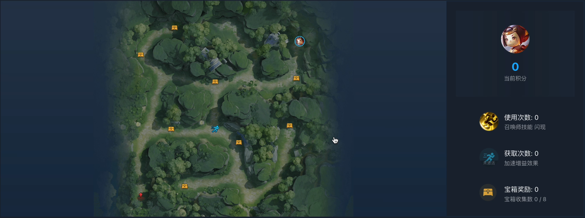

# reinforcement-learning

- [Dynamic Programming](#dynamic-programming)
- [Monte Carlo](#rl-with-monte-carlomc-algorithm)
- [Temporal Difference](#temporal-difference-td-learning)

- [RL for Honor of Kings (a famous game called 王者荣耀 in chinese)](#rl-for-honor-of-kings)

## Environment Description

In this project, we utilize the "Frozen Lake" environment from OpenAI's Gym, which is a grid world environment with a 4x4 size grid as shown in Figure 1-1. Each square on the grid represents a discrete state within the environment.

### The Frozen Lake Environment

- **Start State:** The agent starts from the top-left corner of the grid.
- **Goal State:** The objective is to navigate to the goal state located at the bottom-right corner of the grid.
- **Holes:** There are several holes on the ice, randomly distributed across the grid. Falling into a hole ends the episode.
- **Actions:** The agent can attempt to move in four directions: up, down, left, and right.
- **Transition Probability:** Due to the slippery nature of the ice, the agent's movement direction is stochastic. It may not always move in the intended direction, simulating the potential to slide to adjacent states.
- **Rewards:** The reward for each step taken is 0, except for reaching the goal state, which provides a reward of 1.

The challenge for the reinforcement learning agent is to find a path from the start state to the goal while avoiding the holes, despite the uncertainty in movement caused by the slippery ice.

## Requirements

To run the code in this repository, you will need to have Python and the necessary libraries installed. The code has been tested with the following versions:

- Python: 3.8.13
- gym: 0.24.1
- numpy: 1.23.0

## Dynamic Programming

Dynamic programming is a general approach that can be applied to many different types of problems, including reinforcement learning problems. In this section, we will explore two dynamic programming algorithms: policy iteration and value iteration.

### Policy Iteration

Policy iteration involves computing the state-value function for a given policy according to the Bellman equation through policy evaluation. After evaluating a policy and obtaining its state-value function, we can improve upon this policy. This improvement is done by greedily selecting the action that has the highest action value at each state, thus forming a new policy.

The policy iteration algorithm follows these general steps:

1. Evaluate the current policy to get the state-value function.
2. Improve the policy using the state-value function to get a better policy.
3. Repeat the evaluation and improvement steps until the policy converges to the optimal policy.

### Value Iteration Algorithm Implementation

Policy iteration can be computationally expensive, as it may require many iterations to converge to the state-value function for a given policy. This is particularly true in environments with large state and action spaces. One might ask, do we have to wait for the policy evaluation to complete before we can improve the policy? In some cases, even though the state-value function has not converged, the policy improvement step would yield the same policy regardless. This indicates that policy iteration can sometimes perform unnecessary calculations, presenting an opportunity for further optimization.

In value iteration, there is no explicit policy; instead, we maintain a state-action value function and update it directly.

### Main Optimization: Priority Sweeping Evaluation and Priority Value Iteration

In priority dynamic programming, states are assigned priorities, with higher-priority states having their state values updated first. Priorities are often determined using the Bellman error, which can accelerate convergence at the cost of maintaining a priority queue.

#### Initial Approach

Initially, all states are zero-initialized. We calculate the value of all states using the Bellman expectation equation and place them in a priority queue, where the size of the value change determines the priority. States with larger changes are prioritized. This process repeats, removing the highest priority state from the queue, recalculating its value, and determining whether to keep it in the queue based on a threshold value `theta`. This continues until the queue is empty, and the final values are returned.

#### Encountered Issues

With zero-initialized values and rewards of zero at all states except the goal, the priority queue faces an issue where, except for the state adjacent to the goal, all deltas are zero. After updating the penultimate state, its delta is the largest, leading to it being selected again. However, since its neighbors are not updated, its delta becomes zero. Consequently, many states are prematurely popped from the queue, resulting in incorrect outcomes.

#### New Approach

Instead of using a priority queue, we use a delta array to store the cumulative delta for each state. Whenever a state is updated, its delta is reset to zero. When a neighbor is updated, the cumulative delta is incremented. The state to be updated next is chosen based on `argmax` of the current deltas.

### Results

| Method                                           | Time | Num Iterations            |
|--------------------------------------------------|------|---------------------------|
| Policy Evaluation + Policy Iteration             | 31ms | 2                         |
| Priority Sweeping Evaluation + Policy Iteration  | 30ms | 2                         |
| Value Iteration                                  | 21ms | 57                        |
| Priority Value Iteration                         | 20ms | 683 updates, avg 42.6iter |

## RL with Monte Carlo(MC) Algorithm

This repository contains the implementation of the Monte Carlo algorithm applied to a reinforcement learning problem. The focus is on experimenting with various epsilon decay strategies to optimize the learning process.

### Overview

The Monte Carlo method for reinforcement learning has been enhanced in this repository by comparing three custom decay strategies against already-implemented decay approaches. The primary aim is to facilitate code reusability and allow easy swapping of the epsilon decay function without the need to replicate the entire function for minor modifications.

### Features

- **Epsilon-Greedy Strategy**: The ε-greedy strategy balances exploration and exploitation. In each step of an episode, the agent selects the action with the highest estimated action value with probability 1-ε (exploitation), and with probability ε, it selects an action uniformly at random (exploration).
- **Decay Strategies**: To refine the learning process, we have implemented and compared several epsilon decay strategies that adjust the value of ε as training progresses. This allows the agent to explore widely in the initial stages of learning and gradually shift towards exploiting the learned values as ε decreases. The custom decay strategies (`epsilon_function1`, `epsilon_function2`, `epsilon_function3`) are compared against a default strategy to demonstrate their impact on the learning outcomes.
- **Code Organization**: Adjusted the code structure for easier reuse and abstraction of the epsilon decay function.
- **Multiprocessing**: To handle the time-intensive nature of the training process and numerous testing iterations, a multiprocessing approach was employed. Each process runs a simulation independently, and the results are then aggregated to determine the average running time, number of iterations, and the accuracy of the policy.

### How it Works

The `main` function invokes the `run_worker` function multiple times with different parameters (such as `gamma`, `num_episodes`, and `epsilon_decay_function`). Within `run_worker`, a pool of processes is created where each process independently conducts training over `epochs` (20 by default). The results are aggregated, and the `log` function outputs the results to both the console and `output.txt`.

### Results

The table below presents the performance outcomes for various configurations of the Monte Carlo method applied in reinforcement learning. The `epsilon_function` column indicates the decay strategy employed, with "default" denoting the pre-existing strategy (`epsilon_function0`) and others (`epsilon_function1`, `epsilon_function2`, `epsilon_function3`) indicating the custom-implemented strategies. The metrics recorded are the average result over all episodes, the average time taken (in seconds), and the average number of iterations per episode.

| Name               | Gamma | Num Episodes | Epsilon Function    | Average Result | Average Time (second) | Average Iteration |
|--------------------|-------|--------------|---------------------|----------------|------------------|-------------------|
| Initial Version    | 0.99  | 5000         | epsilon_function0 (defualt) | 0.73305        | 129.298          | 41.8              |
| Optimized Version1 | 0.97  | 5000         | epsilon_function0 (defualt) | 0.64375        | 154.538          | 56.75             |
| Optimized Version2 | 0.99  | 10000        | epsilon_function0 (defualt) | 0.7267         | 97.934           | 18.5              |
| Optimized Version3 | 0.97  | 10000        | epsilon_function0 (defualt) | 0.7126         | 101.638          | 18.5              |
| Optimized Version4 | 0.999 | 10000        | epsilon_function0 (defualt) | 0.733          | 122.914          | 16.85             |
| Optimized Version5 | 0.999 | 5000         | epsilon_function0 (defualt) | 0.72315        | 120.019          | 29                |
| Change Epsilon1    | 0.99  | 5000         | epsilon_function1        | 0.388          | 189.915          | 52.45             |
| Change Epsilon2    | 0.99  | 5000         | epsilon_function2        | 0.695          | 128.637          | 41.85             |
| Change Epsilon3    | 0.99  | 5000         | epsilon_function3        | 0.4167         | 166.509          | 46.85             |
| Change Epsilon1    | 0.99  | 10000        | epsilon_function1        | 0.6738         | 128.478          | 22.35             |
| Change Epsilon2    | 0.99  | 10000        | epsilon_function2        | 0.70015        | 94.105           | 17.3              |
| Change Epsilon3    | 0.99  | 10000        | epsilon_function3        | 0.7237         | 123.8703         | 22.85             |
| Change Epsilon1    | 0.99  | 30000        | epsilon_function1        | 0.7263         | 120.595          | 7.05              |
| Change Epsilon2    | 0.99  | 30000        | epsilon_function2        | 0.7283         | 123.4774         | 9.25              |
| Change Epsilon3    | 0.99  | 30000        | epsilon_function3        | 0.7219         | 87.8453          | 7.45              |

## Temporal Difference (TD) Learning

Temporal Difference Learning is a method used to estimate the value functions of a policy, synthesizing ideas from both Monte Carlo and Dynamic Programming approaches. Similar to Monte Carlo methods, TD Learning can learn from raw experience without a model of the environment's dynamics. Concurrently, it resembles Dynamic Programming in that it updates value estimates based on estimated returns, a concept rooted in the Bellman equations.

In practice, the TD Learning algorithm estimates the return for a state by taking the immediate reward received and adding the estimated value of the subsequent state. This enables us to use TD methods for policy evaluation.

To ensure thorough exploration of the environment, an ε-greedy strategy is also employed. I have implemented the TD(λ) algorithm, investigating how different values of λ affect the speed of convergence towards an optimal policy.

### Results

| λ     | Performance |
|-------|-------------|
| 0.1   | 0.76        |
| 0.5   | 0.74        |
| 0.9   | 0.0         |
| 0.99  | 0.0         |

## RL for Honor of Kings

### Gorge walk

In this project, I trained an intelligent agent to navigate through the gorge. The primary objective is for the agent to learn effective movement strategies through continuous exploration of the map. The goal is to minimize collisions with obstacles, reach the destination from the starting point using as few frames as possible, and collect as many treasure chests as possible along the way.

video demo: 

[https://drive.google.com/file/d/1ly7HRwo-SnMbbSq-f2ULFQtxCVlxyeOA/view?usp=sharing](https://drive.google.com/file/d/1ly7HRwo-SnMbbSq-f2ULFQtxCVlxyeOA/view?usp=sharing)

or

[https://github.com/zyt600/reinforcement-learning/blob/main/resource/Wangzherongyao.mov](https://github.com/zyt600/reinforcement-learning/blob/main/resource/Wangzherongyao.mov)

#### Structure

I used the DQN algorithm with a CNN network to extract features from the environment, and utilized epsilon greedy for exploration and learning. The train is on Tecent Kaiwu Framework.

#### Result

The agent can reach the destination from the starting point using 343 frames (the limitation is 6000), and collect 2 treasure chests along the way.

### 1v1 game (on going)

The project involves training a hero with different kinds of skills to navigate a map, aiming to gathering resources to enhance the hero's attack power. The primary objective is to be the first to destroy the opponent's crystal. If our crystal is destroyed, the opponent wins. The focus is on strategic accumulation of in-game economy and experience to gain a competitive edge.

